# Lab Guide

## Getting Started with Azure Marketplace

### Overview

In this lab you will learn to use Azure Marketplace to deploy various Azure products and services.

### More Information

- [Microsoft Learn Azure Marketplace Documentation](https://learn.microsoft.com/en-us/marketplace/azure-marketplace-overview)

### Time Estimate

- 80 minutes

### Accessing Microsoft Azure

Navigate to the Azure portal via the below URL.

```
https://portal.azure.com
```

## Exercise 1: Purchase and Deploy an Azure Application

### Overview

In this exercise, you will learn to purchase and deploy an Azure app. 

### Time Estimate

- 10 minutes

### Setup Microsoft Sentinel

1. In the search bar, search Microsoft Sentinel and select.

    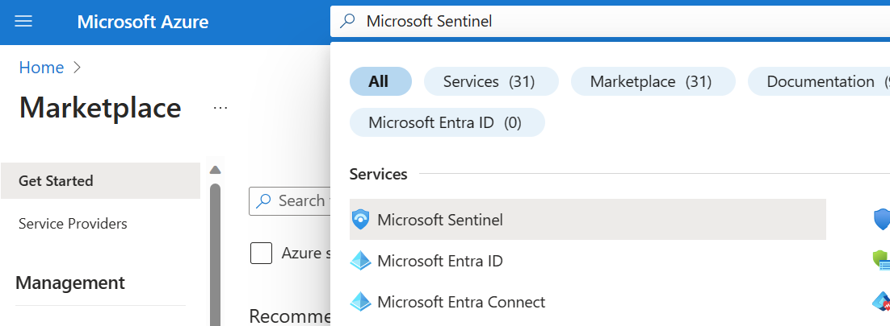
   
2. In Microsoft Sentinel, Select **+ Create** to create a workspace.

    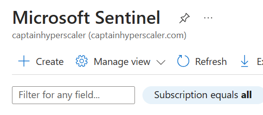
   
3. Select **Create a new workspace**.

    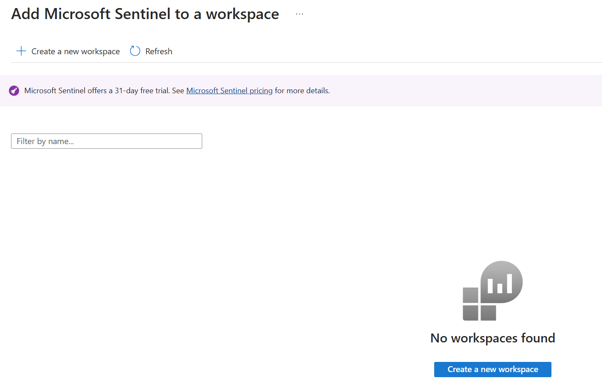
   
4. Under Resource group, select **Create new**.
 
5. Enter a name for the **Resource group**, select **Ok**.

    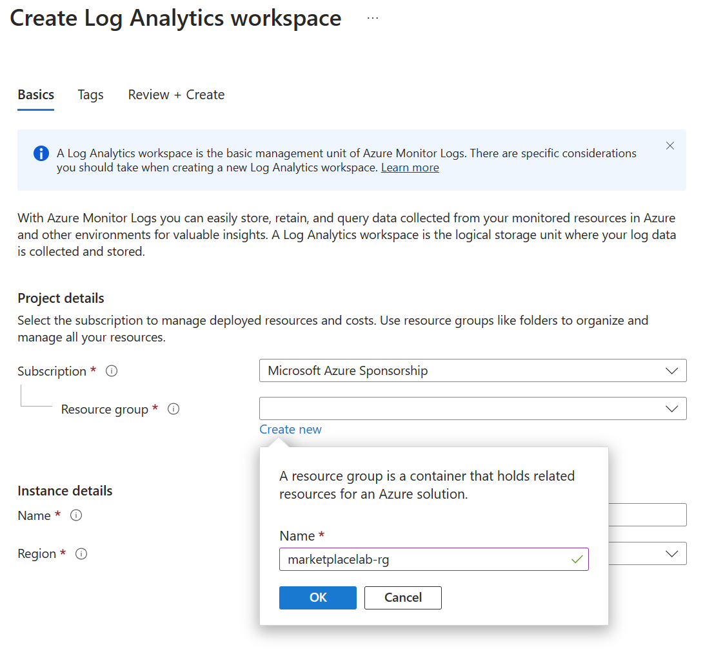
    
6. Enter a name for the **Workspace**.
    
7. Select **Review + create**.

    

8. Select **Create**.

   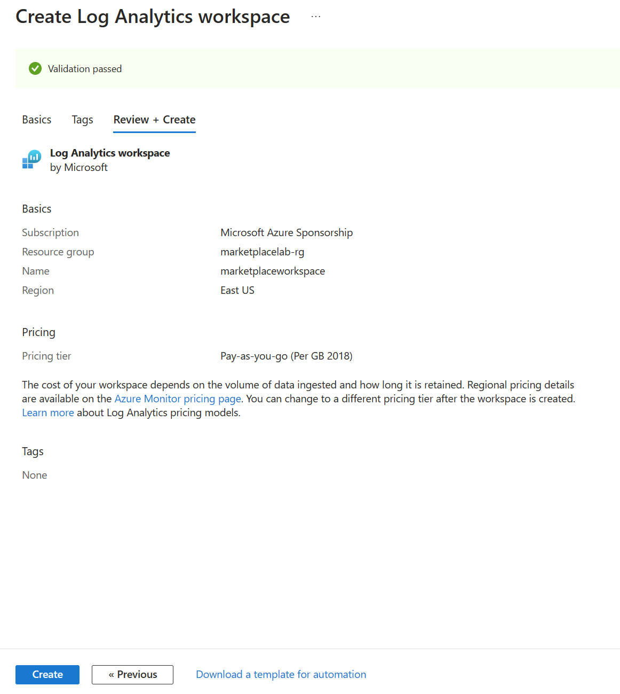

### Task 1: Purchase and Deploy an Azure Application

1. Expand the portal's left navigation by clicking **Show portal menu** then click **+ Create a resource**.

    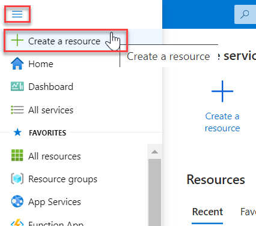

2. In the upper-right of the page, next to **Popular Marketplace products**, select **See more in Marketplace**.

    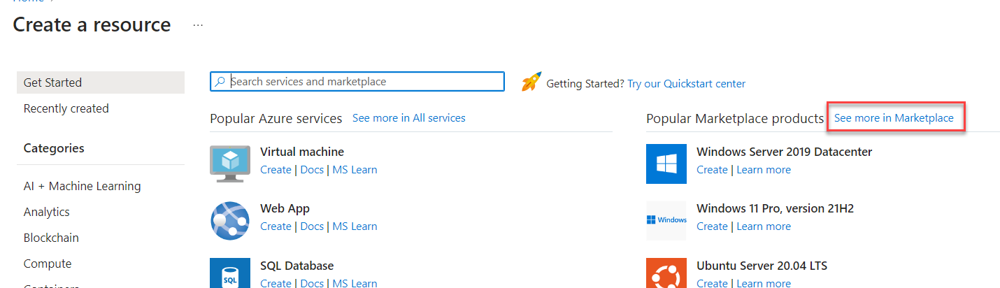

3. To view only Azure Application offers, click **Product Type** near the top of the page, then select **Azure Applications**.

    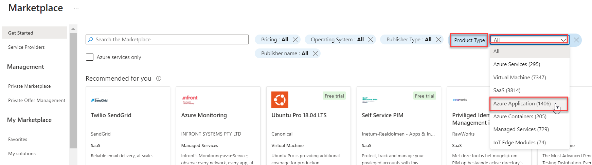

4. You can also filter the results by pricing, operating system, publisher type, and publisher name. You can also select a category on the left of the page to further filter the results.

5. Select the **Azure Active Directory Identity Protection** offer. 

    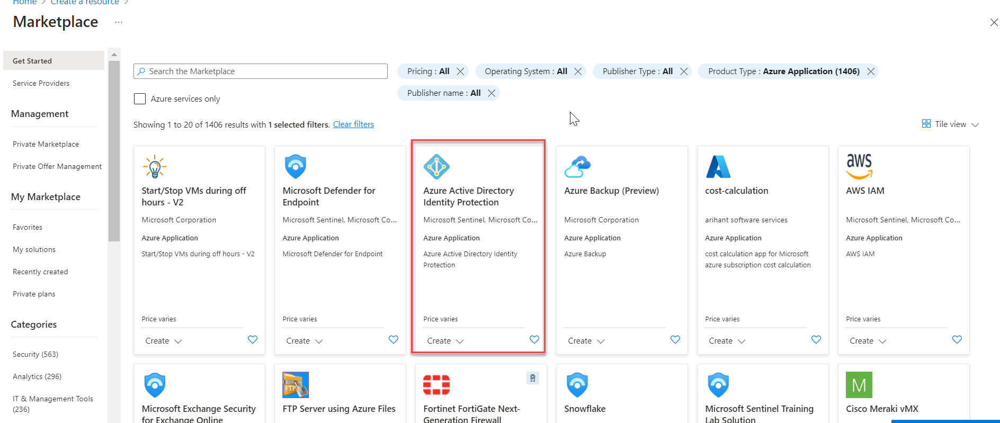

6. Some app offers have multiple plans, and they can be selected via the **Plan** dropdown. Click **Create**.

    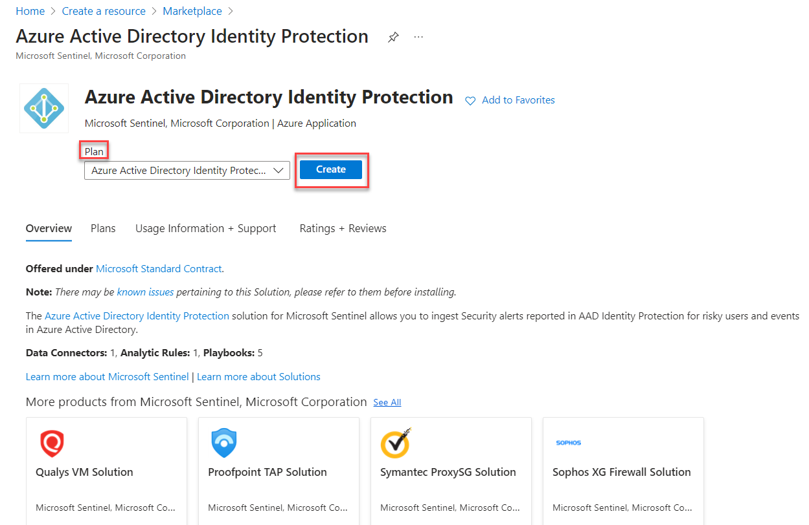

7. To deploy the app, you would input the required information then click **Review + create** then **Create**. Other input fields in the Marketplace experience vary between publishers and offers. Each offer might collect different input based on it's needs.

    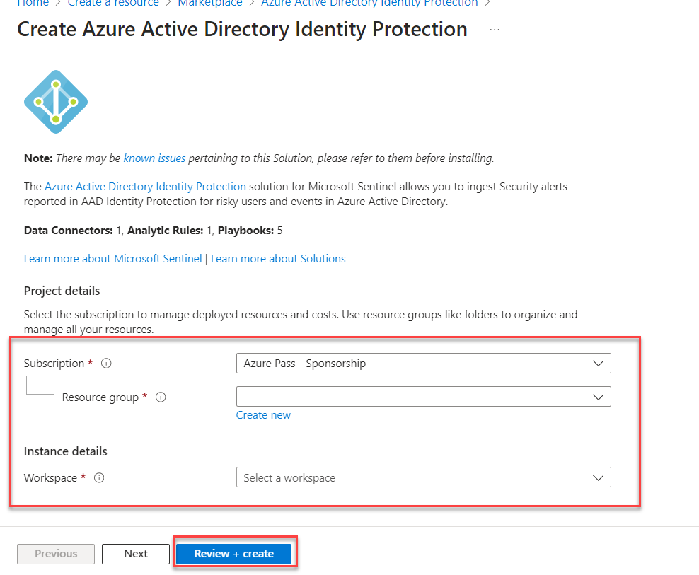

### Summary

In this exercise, you learned to purchase and deploy an Azure app. 
