# Lab Guide

## Getting Started with Azure Marketplace

### Overview

In this lab you will learn how to assign RBAC permissions to users to govern the creation of resources.

### More Information

- [Microsoft Learn Azure Marketplace Documentation](https://learn.microsoft.com/en-us/marketplace/azure-marketplace-overview)

### Time Estimate

- 80 minutes

### Accessing Microsoft Azure

Navigate to the Azure portal via the below URL.

```
https://portal.azure.com
```

## Exercise 1: Review Entra ID role assignments

### Overview

In this exercise, you will learn how to navigate Entra ID and understand users and roles. 

### Time Estimate

- 20 minutes

### Task 1: Entra ID Global Admin

1. In the search bar, search Entra ID and select.

    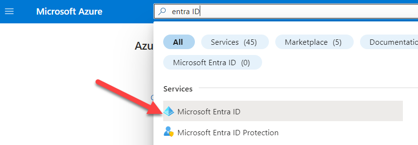
   
2. In the Entra ID menu, Select **Users** under **Manage**.

    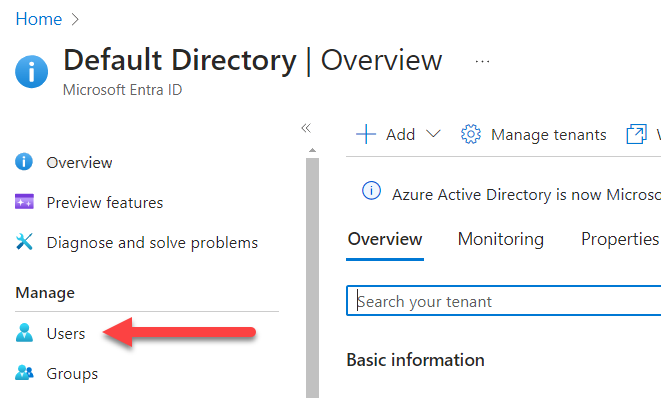
   
3. Select the user **Display name** for the user that you used to log into the **Azure portal**. It should be the **MicrosoftAccount** under **Identities**.

    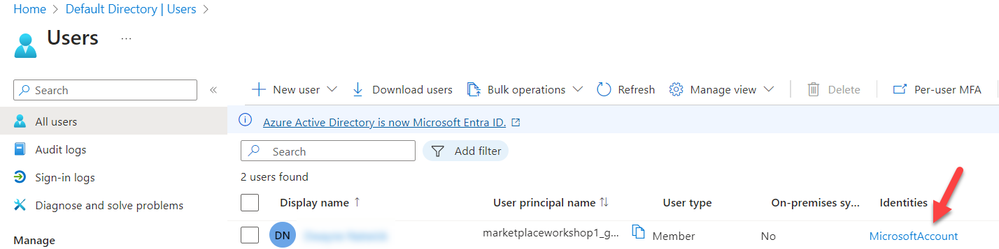
   
4. Under **Manage**, select **Assigned roles**.
 
5. Note that this user is the **Global Administrator** for the entire **Directory**.

    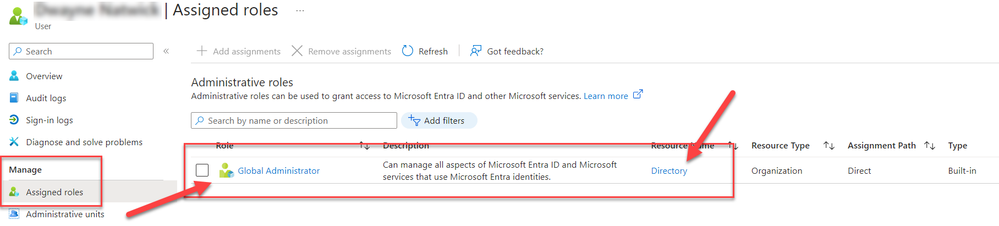
    

### Summary

In this exercise, you learned how to view a user role in Entra ID.

### Task 2: Create a new user and assign RBAC permission

1. Select **Default Directory | Users** at the top of the portal screen.

    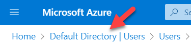

2. In the side menu, select **Users**.

    

3. From the **+ New user** drop-down selections, select **Create new user**.

    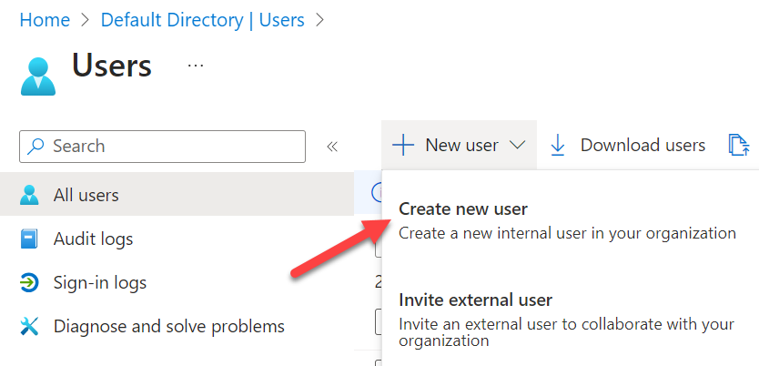

4. Enter **purchasing** for the **User principal name** and **Display name**.  Copy and paste the Auto-generated password to notepad.  Select **Review + create**.

  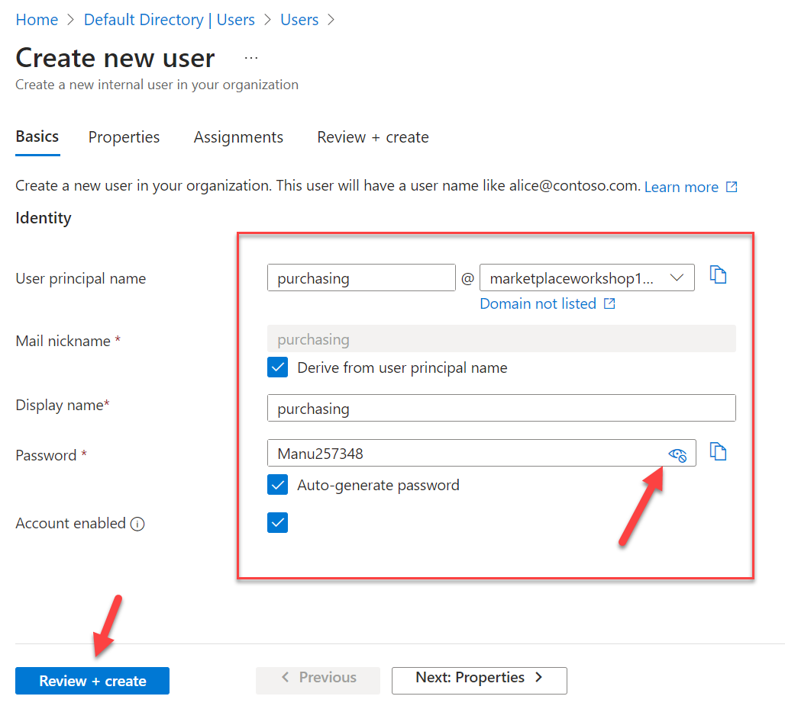

5. Select **Create**. 

    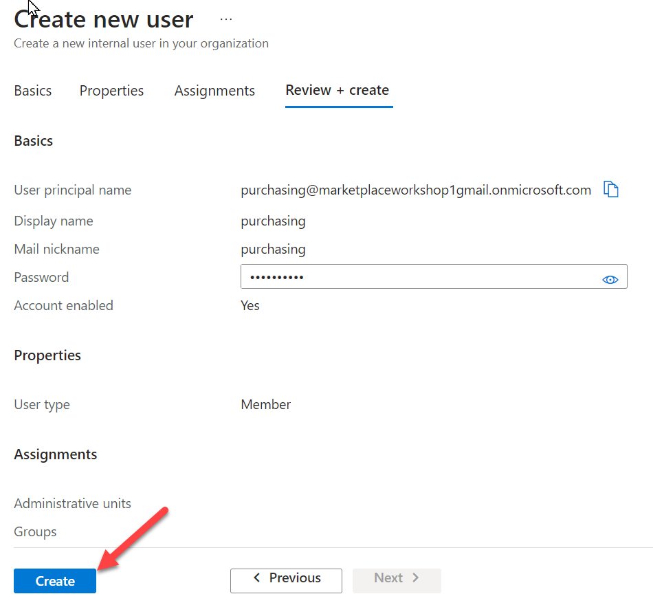

6. You have two users now in your list of users.

    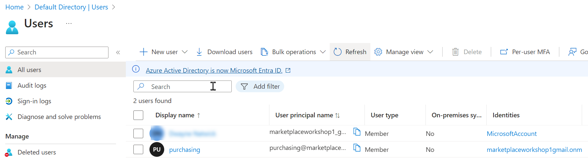

7. To deploy the app, you would input the required information then click **Review + create** then **Create**. Other input fields in the Marketplace experience vary between publishers and offers. Each offer might collect different input based on it's needs.

    

8. In the Azure portal search bar, enter **Resource groups** and select.

    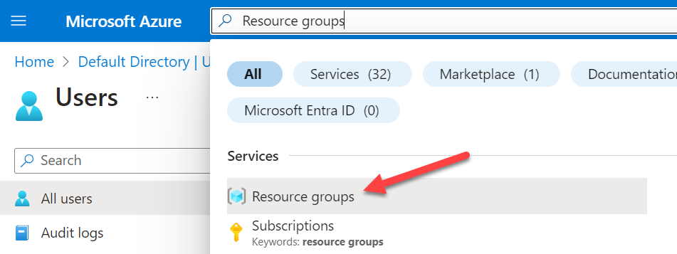

9. Select the **LabRG** that was created in Exercise 1.

    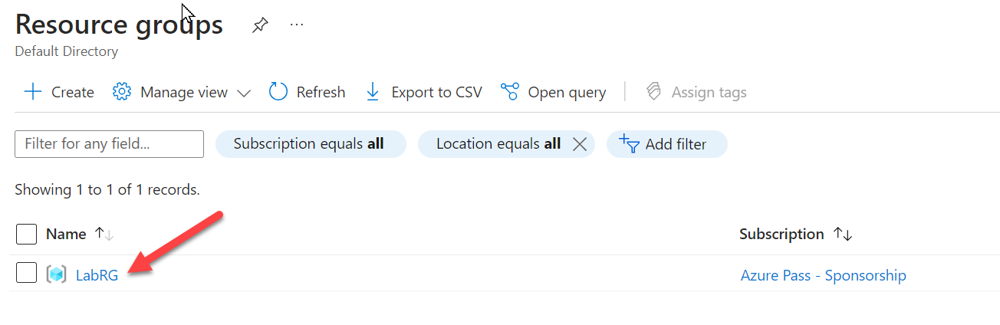

10. Select **Access control (IAM)** under the **LabRG** menu.

    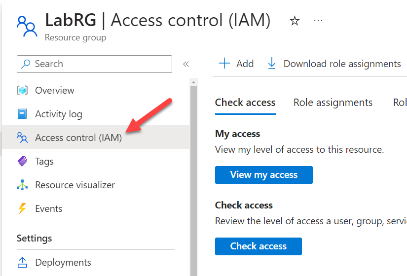

11. Select **+Add** to open the drop-down menu and select **Add role assignment**.

    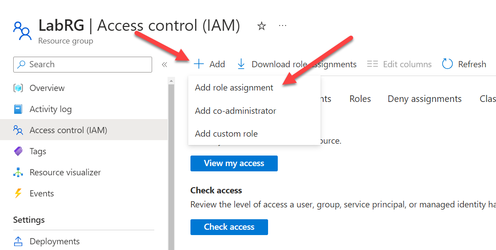

12. Select **Privileged administrator roles** and select the **Contributor** role name.  Select **Next**.

    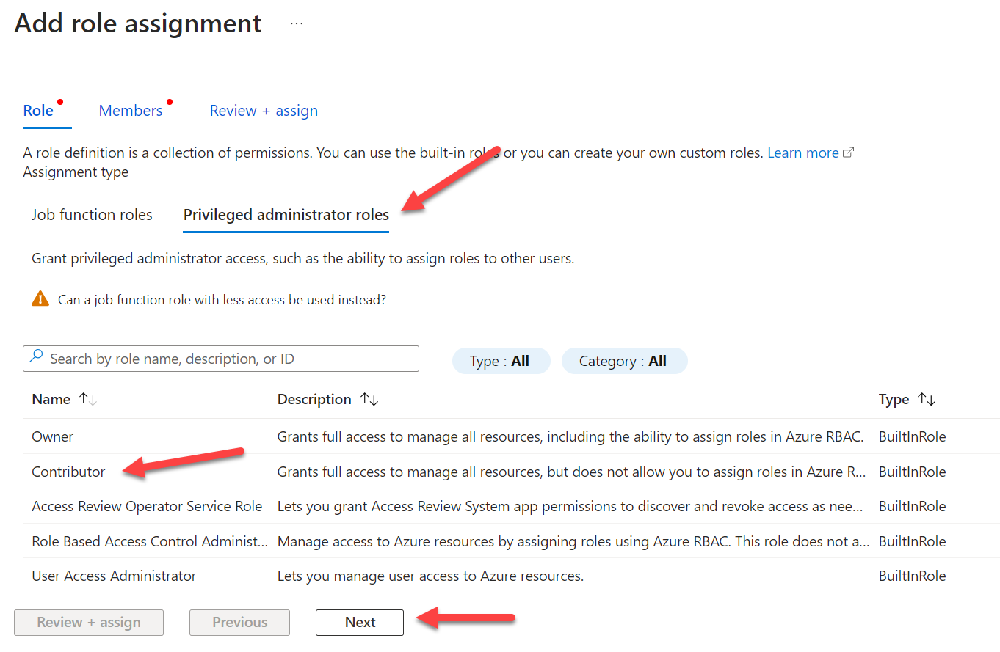

13. Within the **Add role assignment** tile, select **+Select members**.  Select the **purchasing** user that was created previously. Choose **Select** to save. 

    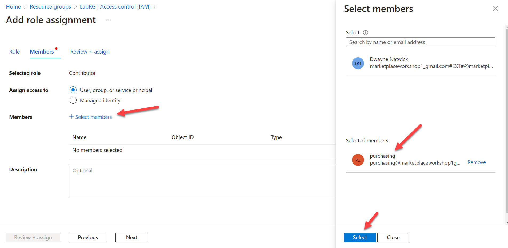

14. Select **Review + assign** to continue.

    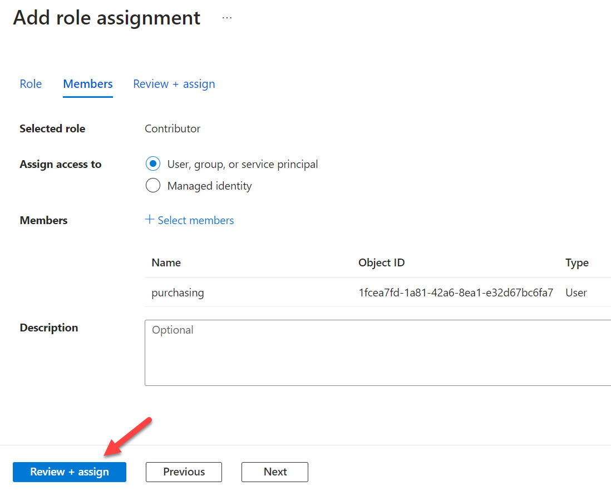

15. A message will appear asking if there is a different role that could be assigned. Select **Review + assign** again to confirm this role assignment.

16. Return to **Access control (IAM)** and select **Role assignments** to view the **purchasing** user as a **Contributor**.

    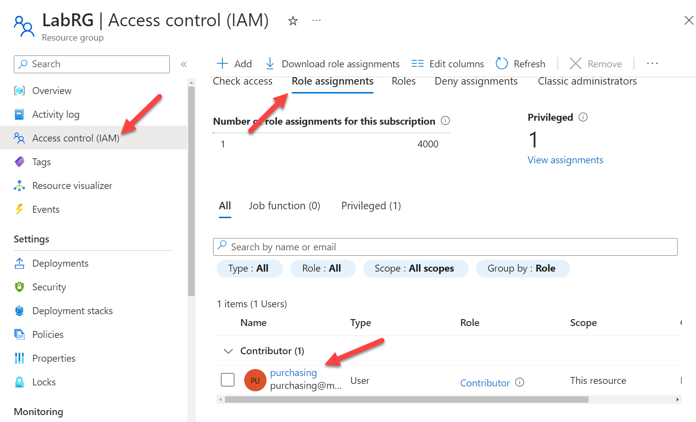

17. **Role assignment** is complete.

### Summary

In this exercise, you created a new user and assigned RBAC permissions to a resource group. 


### Overview

In this task, you will review the governance for purchasing from the marketplace. 

### Task 3: Attempt to purchase from Marketplace within the Subscription

1. 
