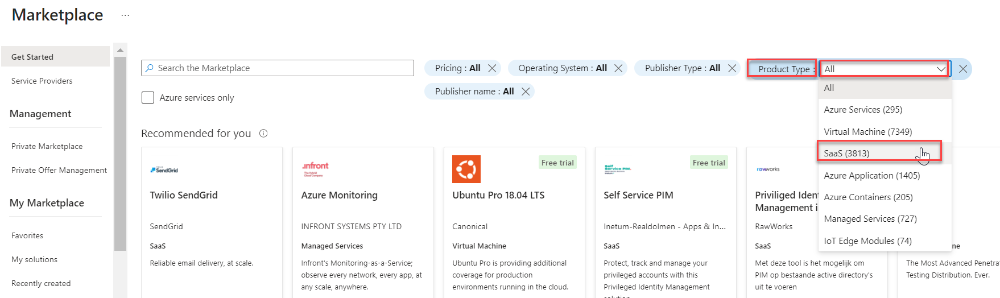
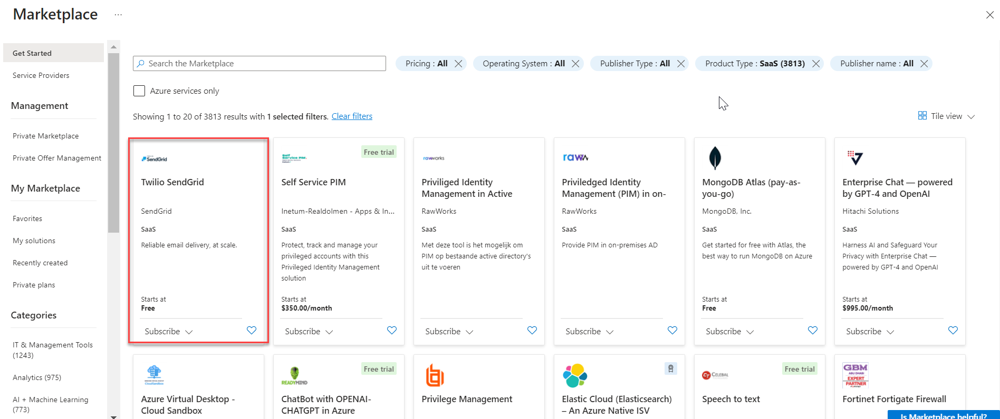
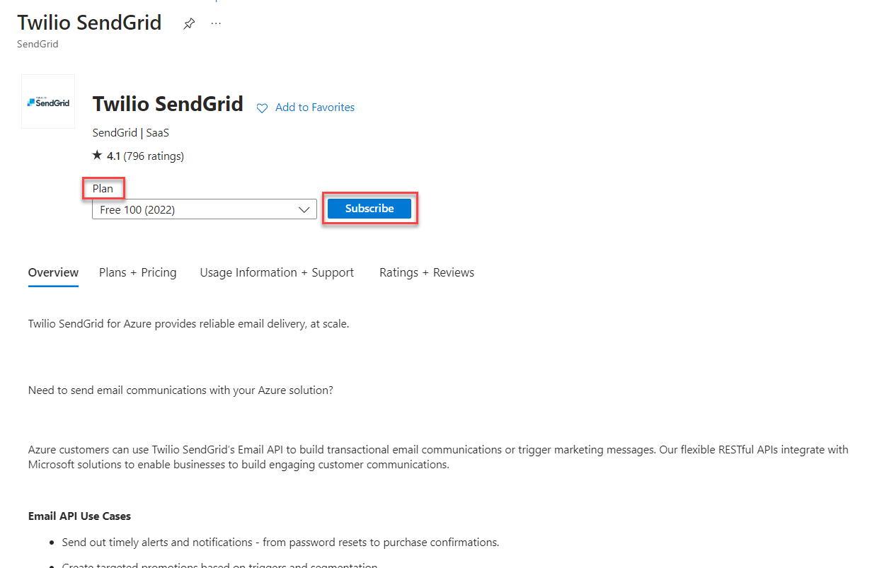
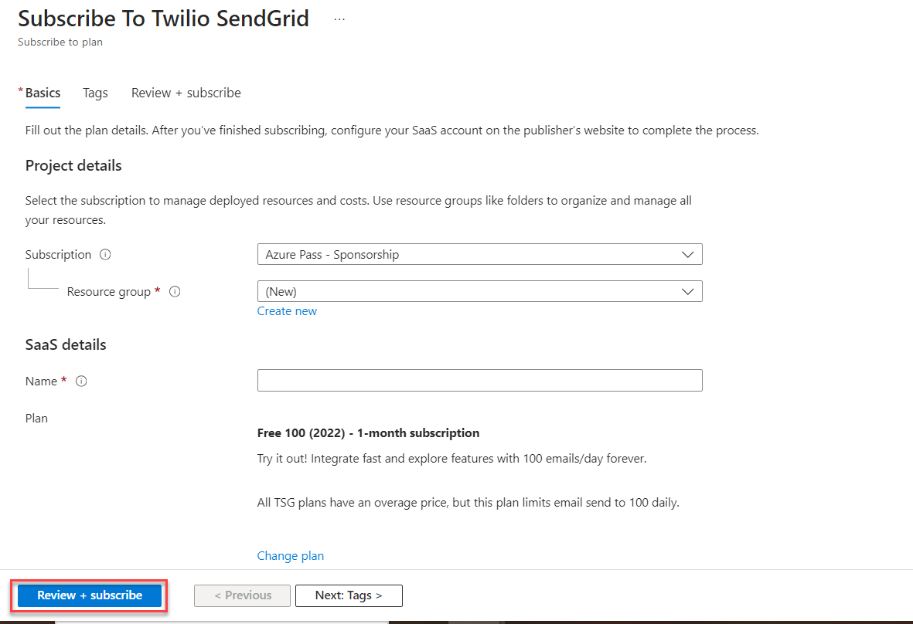

# Exercise 3: Purchasing and Subscribing to a SaaS offer in Marketplace

### Overview

In this exercise, you will learn to purchase and subscribe to a SaaS offer in Marketplace.

### Time Estimate

- 10 minutes

### Task 1: Purchasing and Subscribing to a SaaS offer in Marketplace

1. Expand the portal's left navigation by clicking **Show portal menu** then click **+ Create a resource**.

    

2. In the upper-right of the page, next to **Popular Marketplace products**, select **See more in Marketplace**.

    

3. To view only SaaS offers, click **Product Type** near the top of the page, then select **SaaS**.

    

4. Select the **Twilio SendGrid** offer. 

    

5. Like Azure apps and virtual machines, many SaaS offers in Azure have multiple plans and they can be selected via the **Plan** dropdown. Click **Subscribe**. 

    

6. To subscribe to the offer, you would input the required information then click **Review + subscribe** then **Subscribe**. Other input fields in the Marketplace experience vary between publishers and offers. Each offer might collect different input based on it's needs.

    

### Summary

In this exercise, you learned to purchase and subscribe to a SaaS offer in Marketplace.