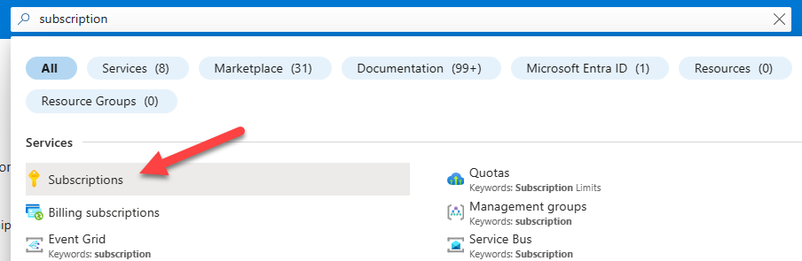
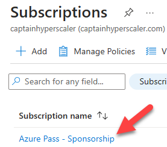
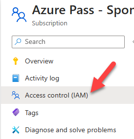
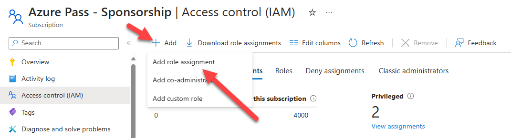
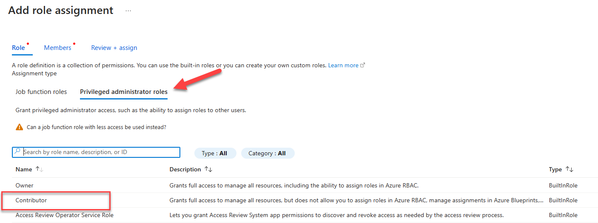
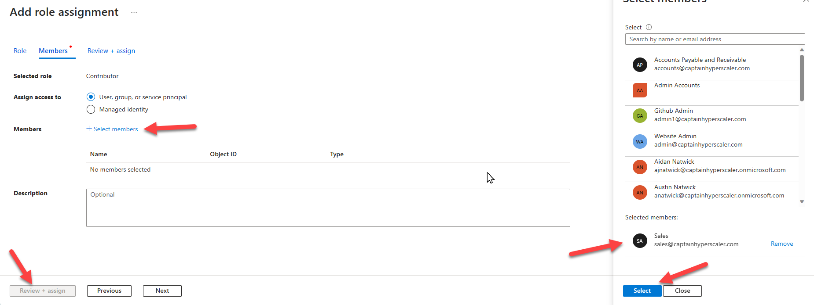
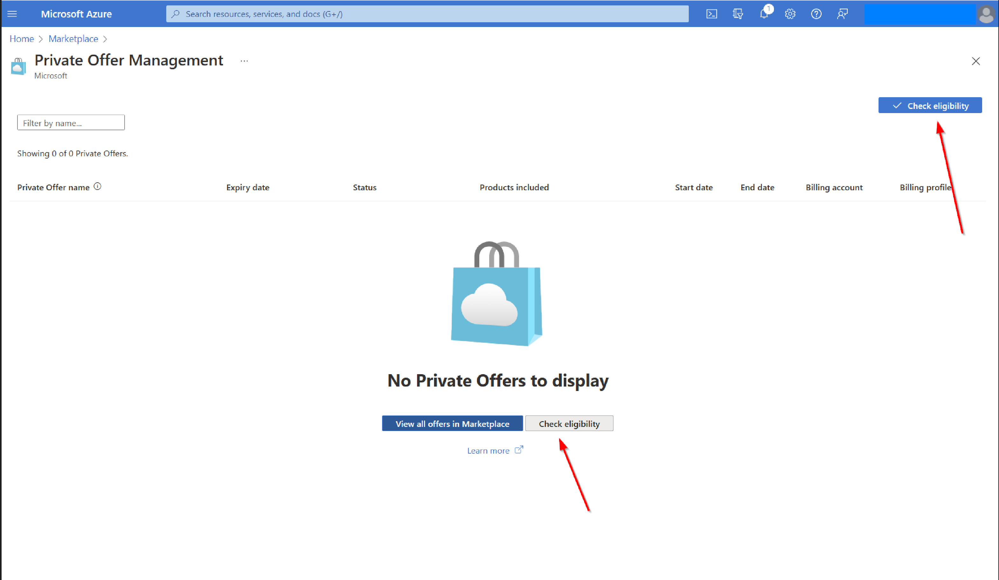
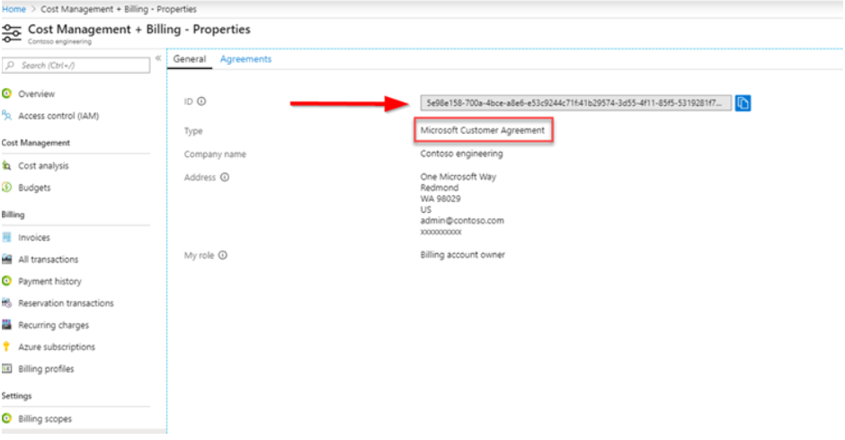
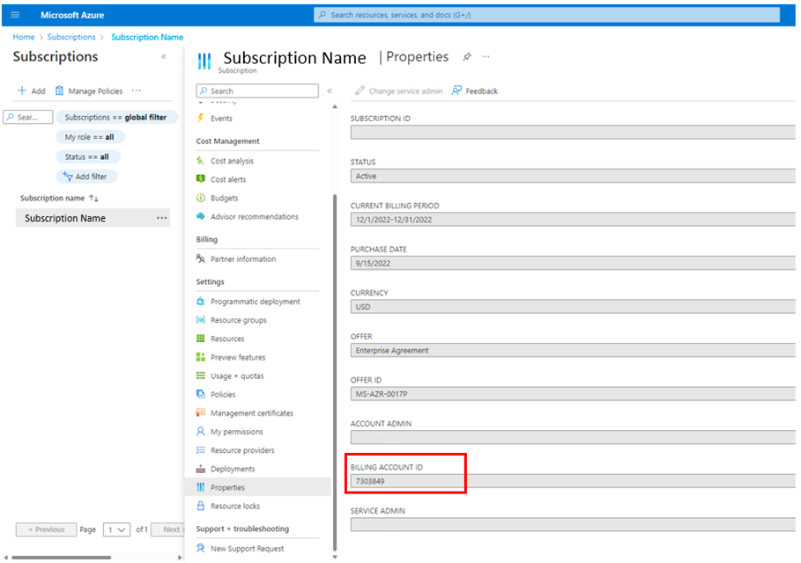

# Exercise 5: Private offers in Marketplace

### Overview

In this exercise, you will learn to prepare and accept a Private offer through marketplace.

### Time Estimate

- 20 minutes

### Task 1: Prepare to accept private offers

A private offer is a solution customized for your needs and sent to you by the partner. This article explains the steps for procuring a private offer and performing checks to avoid issues during purchase. Private offers are different from private plans.

1. Check permissions.  For a Microsoft Cloud Agreement (MCA) customer, you must be **Billing account owner or Billing account contributor** to accept an offer.  To purchase or subscribe to an offer, you must be a **Subscription owner or subscription contributor**.

2. Search **Subscription** in the portal search bar and choose **Subscription**.

    

3. Choose the **Azure Pass - Sponsorship** subscription.

    

4. Select **Access control (IAM)** in the menu.

    

5. Select **Role assignments** and choose **+Add** and **Add role assignment**.

    

6. Select the **Privileged administrator roles** tab and select **Contributor**.  You can select **Owner**, but you want to adhere to the principles of least privilege access. Select **Next**.

    

7. Choose **+ Select members** and select your user account. Choose **Select** and **Review + assign**.  Select **Assign**.

    

### Task 2: Find your billing account ID

1. Run the private offers precheck report described in the step before and download the report for details. The report will contain your billing account ID.

2. From the Azure portal, select Marketplace > Private offers management (or Private products), then select Check eligibility.
   
    

3. A summary report will be shown after finishing the scan. More details are available in a downloadable CSV file.

4. In the Azure portal, select Cost management + Billing > Properties > ID. A user in your organization with access to Cost Management + Billing will be able to access the billing account and verify the ID in Azure portal.

    
   
5. If you know the subscription you plan to use for the purchase, in the Azure portal, select Subscriptions, select the relevant subscription > Properties (or Billing Properties) > Billing account ID.

    

6. Additional information on accepting an offer can be found here:
    [Accept the private offer](https://learn.microsoft.com/en-us/marketplace/private-offers-in-azure-marketplace)

### Summary

In this exercise, you learned to prepare and accept a Private offer through marketplace.
