# Exercise 4: Setup a Private Marketplace

### Overview

In this exercise, you will learn to setup a private marketplace. 

### Time Estimate

- 10 minutes

### Prerequisites 

These prerequisites are required before you can assign the Marketplace Admin role to a user on the tenant scope:

    - You have access to a Global administrator user.

    - The tenant has at least one subscription (can be any type).

    - The Global administrator user is assigned the Contributor role or higher for the chosen subscription.

    - Assign the Marketplace admin role with access control (IAM)

### Task 1: Assign the Marketplace Admin Role to a User in the Tenant

1. Expand the portal's left navigation by clicking **Show portal menu** then click **All services**.

    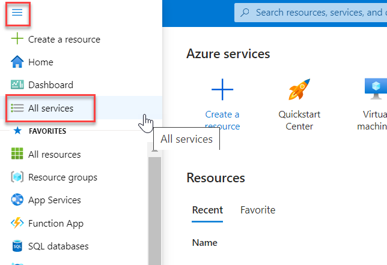

2. Search for and select **Marketplace**. 

    

3. Select **Private Marketplace** on the left.

    

4. Select **Access control (IAM)** on the left. Click **+ Add** then **Add role assignment**.

    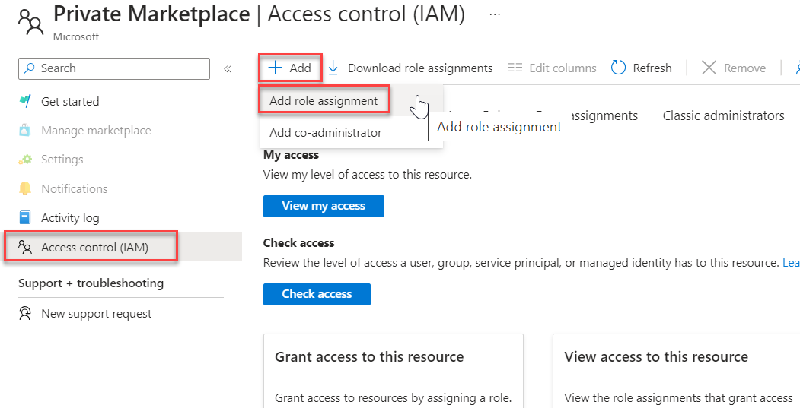

5. Search for and select **Marketplace Admin** then click **Next**.

    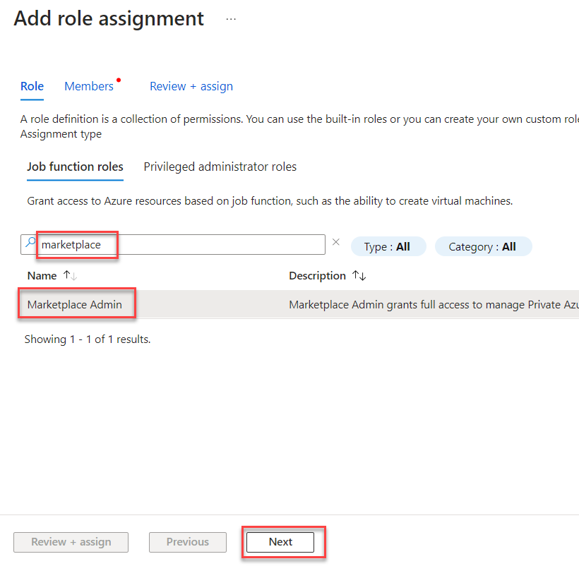

6. Click **+ Select members** then select the user you created at the beginning of the lab who you are currently signed in as and click **Select**. Click **Next** then **Review + assign**. 

    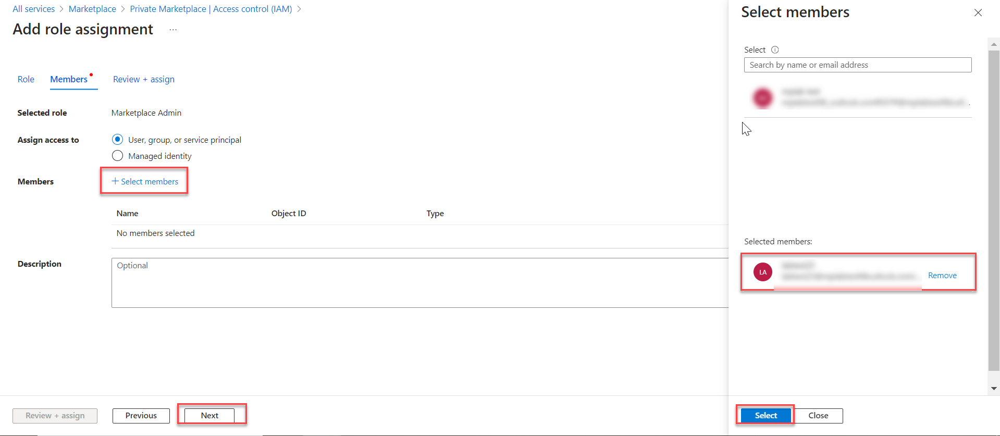

### Task 2: Create a Private Azure Marketplace

1. Click **Get started** on the left then click **Get started** on the page. Once complete, you will have a disabled Private Azure Marketplace with one Default Collection.

    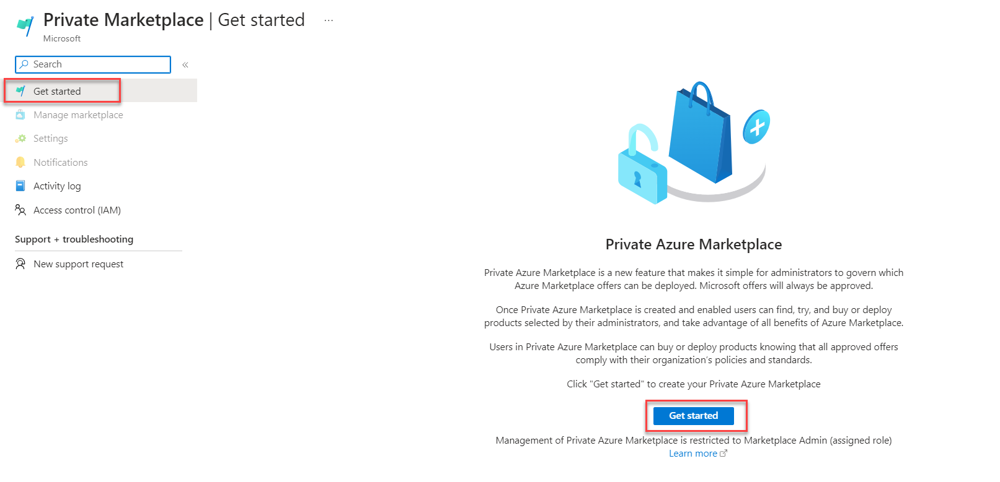

    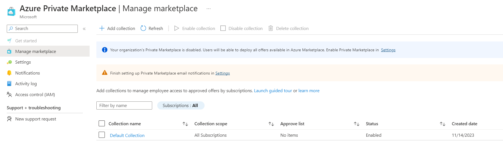

    >**Note:** You may have to refresh the page. 

2. Click **Default collection** then **Add selected items**. 

    

3. Select a few items then click **Done**. 

    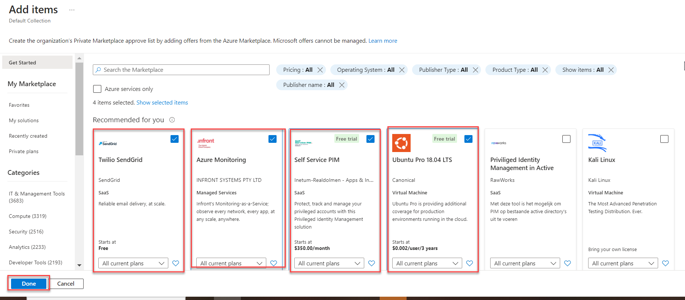

    >**Note:** By default, when adding a new offer, all current plans will be added to the approved list. To modify the plan selection before adding the selected items, select the drop-down menu in the offer and update the required plans.

    >**Note:** Microsoft solutions (including Endorsed Linux Distributions) are tagged as *Approved by default* and cannot be managed in Private Marketplace.

4. Using the **Plans** dropdown located next to each item in your marketplace, you can select which plans will be available to users.

    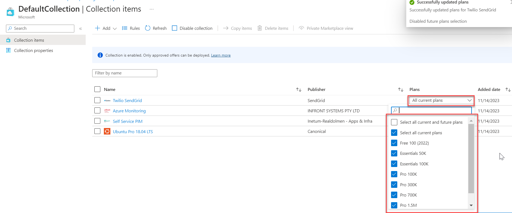

5. You can select an item(s) in the list and click **Delete items** to remove it from the private marketplace. 

    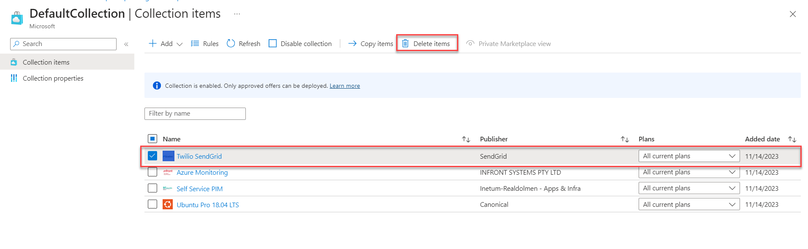

6. You can also select an item(s) in the list and click **Copy items** to copy them to different collections. You would simply select a different collection then click **Copy**. 

    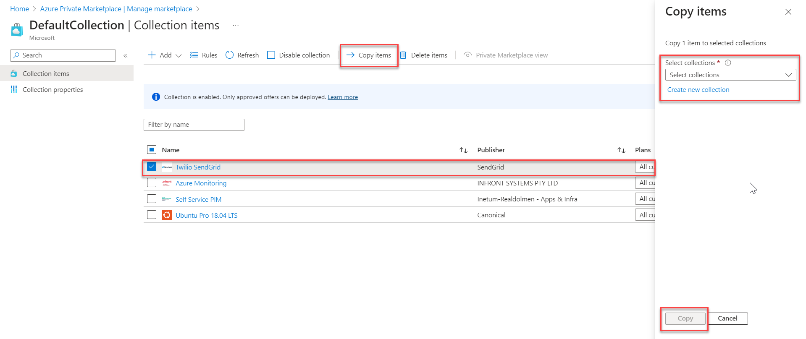

7. A collection can be enabled or disabled by simply clicking the **Disable collection** or **Enable collection** button on the collection page. 

    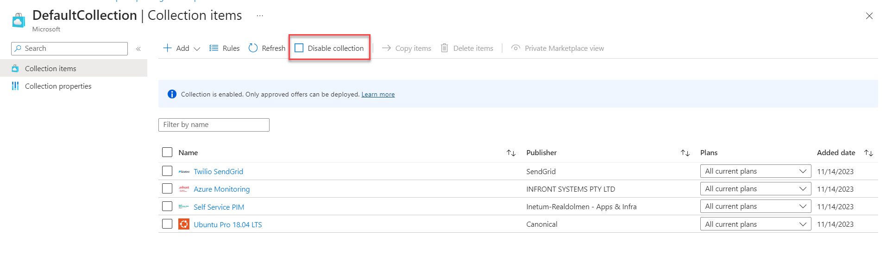

8. A private marketplace can be enabled or disabled by clicking **Settings** on the left of the marketplace page, selecting one of the options, and clicking **Apply**. 

    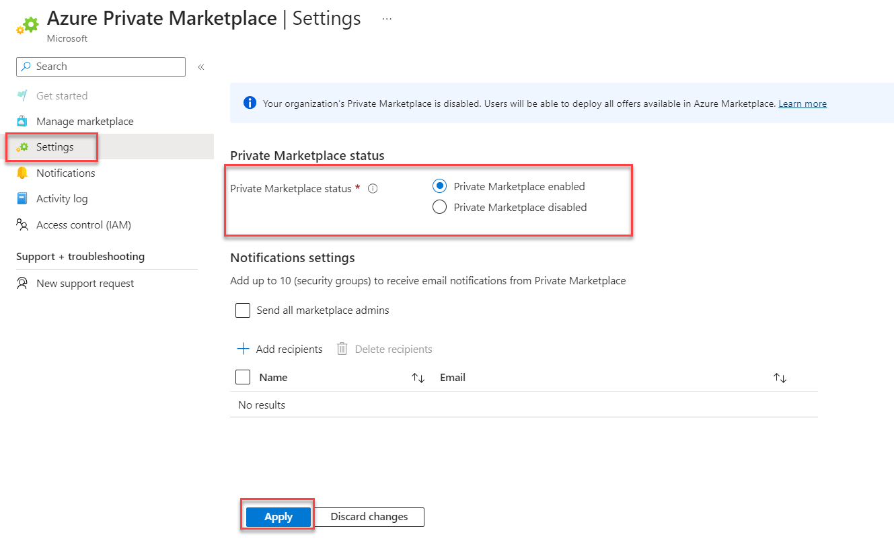

### Task 3: Create and Manage a New Collection

1. You can create a new collection in your Azure private marketplace by clicking **Manage marketplace** on the left and selecting **+New Collection**. In the dialog that appears on the right, enter a name for the collection and click **Create**. 

    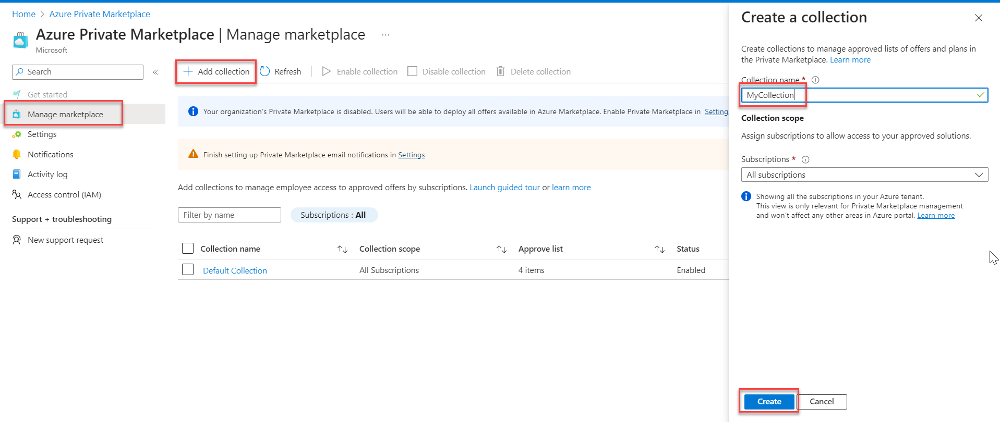

2. You can then select the collection you created and add items, modify plans, copy items, and enable or disable the collection as shown in the previous task.
    
    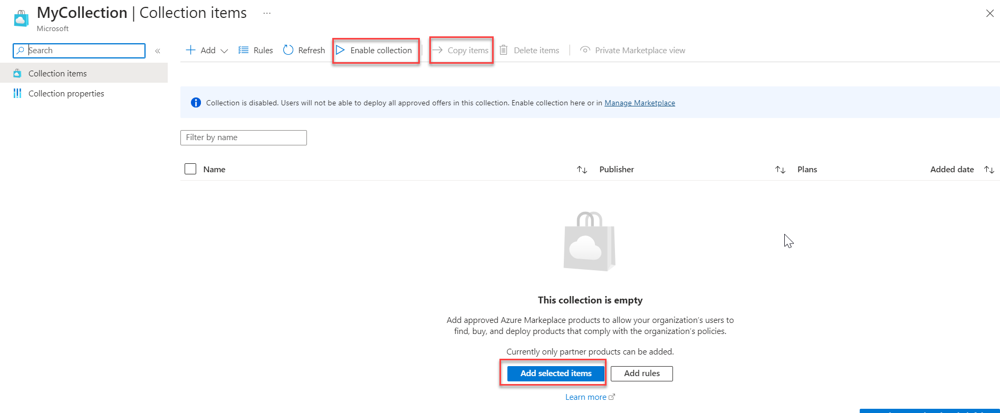

3. You can change a collection's name and associated subscriptions by clicking **Collection properties** on the left of the collection's page. 

    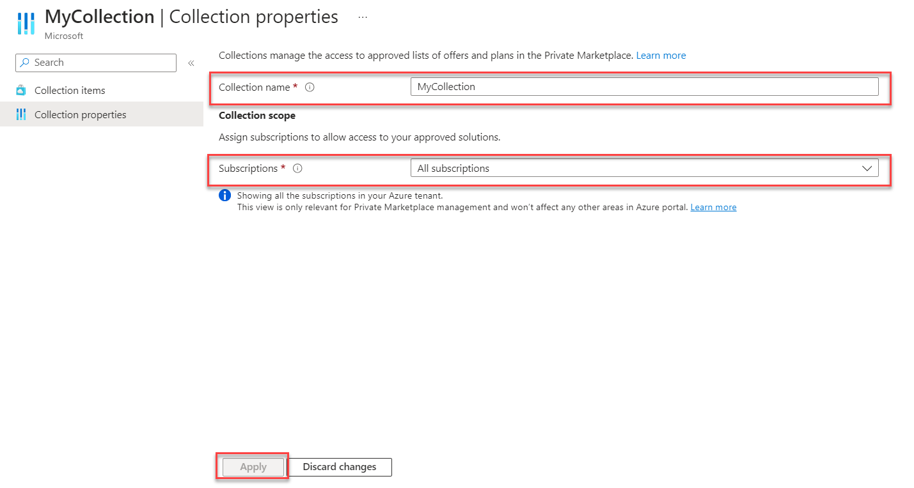

4. A collection can be deleted by first selecting it on the private marketplace page and clicking **Delete collection**. 

    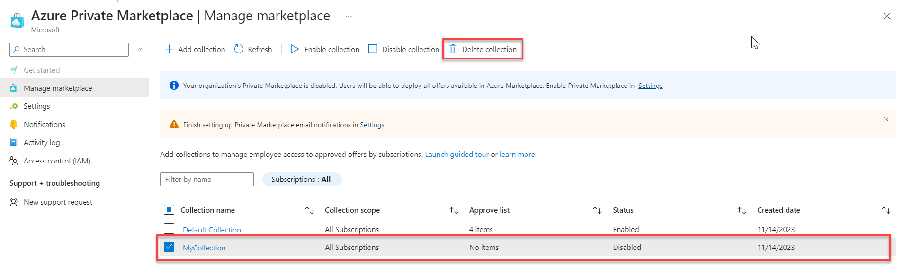

    >**Note:** The default collection is a system-generated collection and can't be deleted.

### Task 8: Notifications settings

1. On the private marketplace page, click **Settings** on the left. 

    

2. You can enable email notifications from the private marketplace to marketplace admins by checking the **Send all marketplace admins** box and clicking **Apply**. You can create your own groups of users to which to send email notifications as well.

    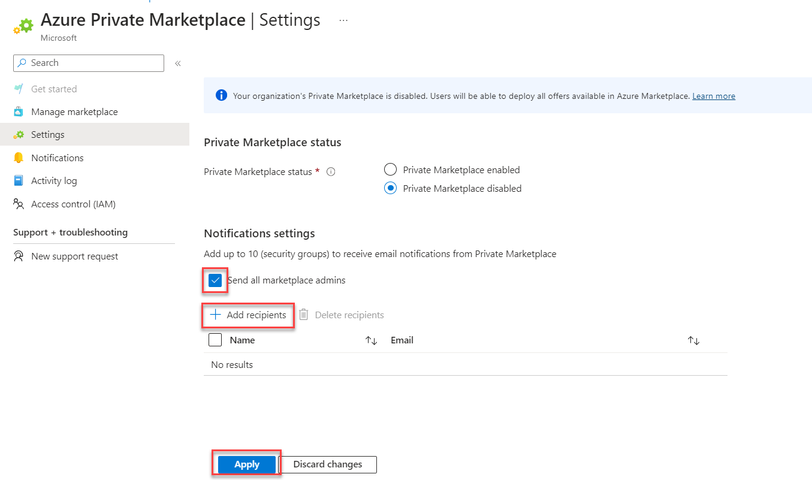

### Summary

In this exercise, you learned to setup a private marketplace. 
