# Exercise 7 Lab Guide

## Create a policy assignment to govern location compliance

### Overview

In this lab you will learn to use Azure Policy to govern resource deployment within Azure.

### More Information

- [Microsoft Learn Azure Policy Documentation](https://learn.microsoft.com/en-us/azure/governance/policy/overview)

### Time Estimate

- 30 minutes

### Task 1: Create a policy assignment for Resource group allowed locations.

1. Launch the Azure Policy service in the Azure portal by selecting All services, then searching for and selecting Policy.

  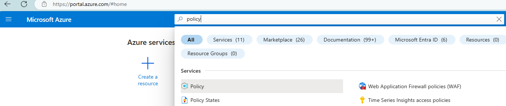

2. Select **Assignments** on the left side of the Azure Policy page. An assignment is a policy that has been assigned to take place within a specific scope.

  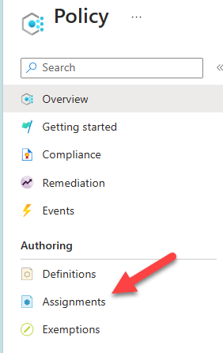

3. Select **Assign Policy** from the top of the Policy - Assignments page.

  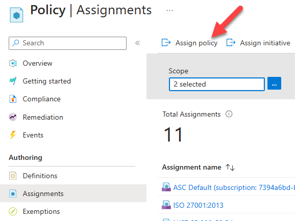
  
4. On the Assign Policy page, set the Scope by selecting the ellipsis and then select the Azure pass subscription. Select the marketplace resource group that you have created. A scope determines what resources or grouping of resources the policy assignment gets enforced on. Then use the Select button at the bottom of the Scope page.

  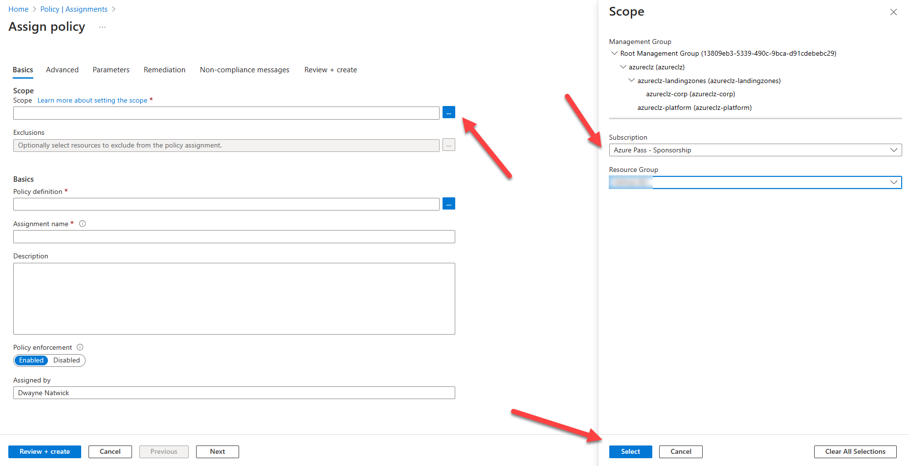

5. Select the **Policy definition** ellipsis to open the list of available definitions. Azure Policy comes with built-in policy definitions you can use. Search **location**.

  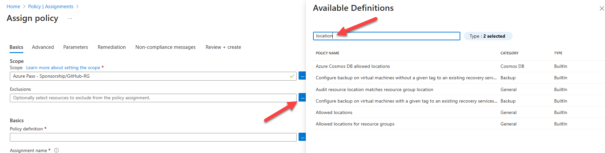

6. Select **Allowed locations**.  Select **Add**.

  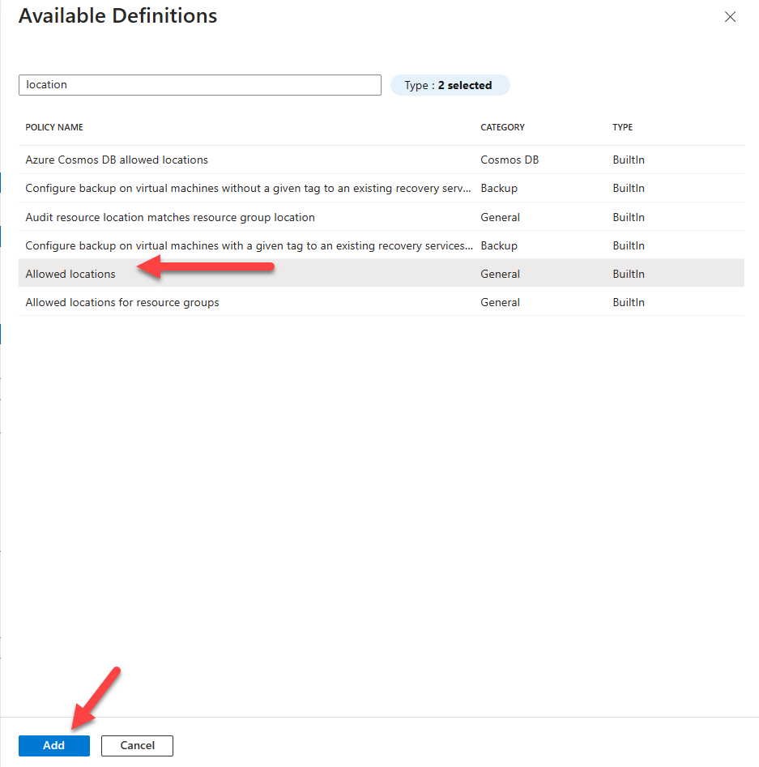

7. Select **Next** twice to arrive at the **Parameters** tab.

  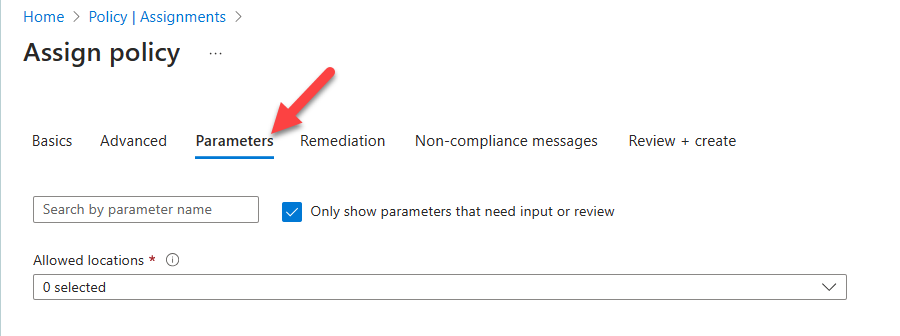

8. Select the **Allowed locations** drop-down, search **US**, and choose **East US**, **East US 2**, **Central US**, **North Central**, **South Central US**, **West US**, and **West US 2**.

  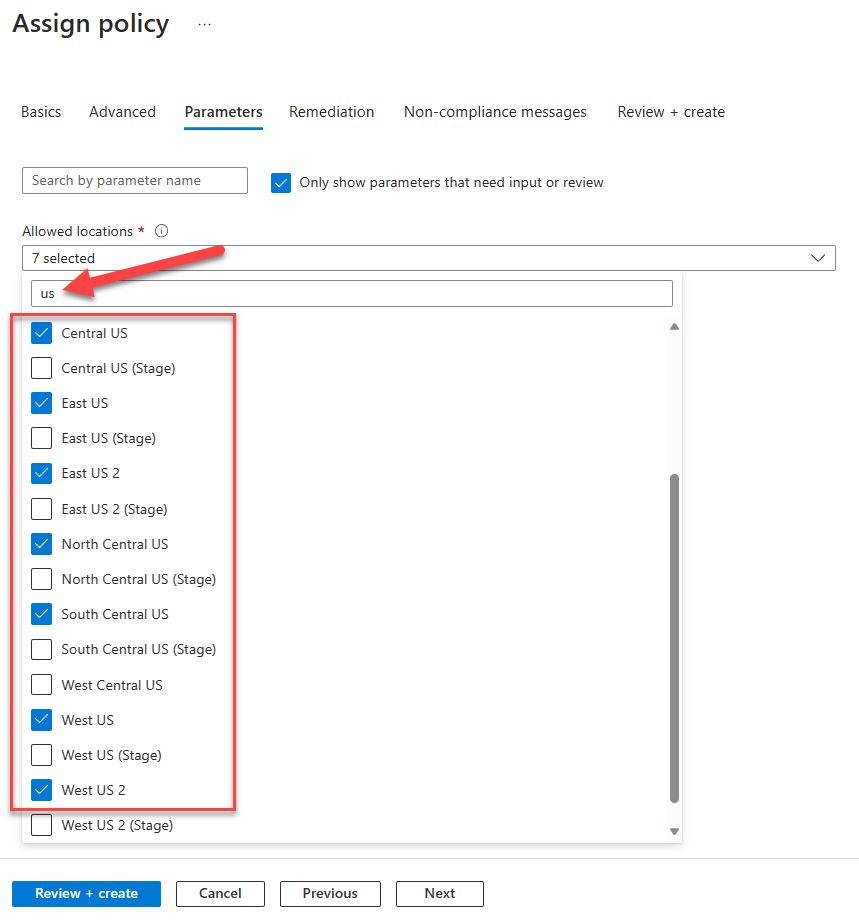

9. Select **Review + create**.  Select **Create**.

  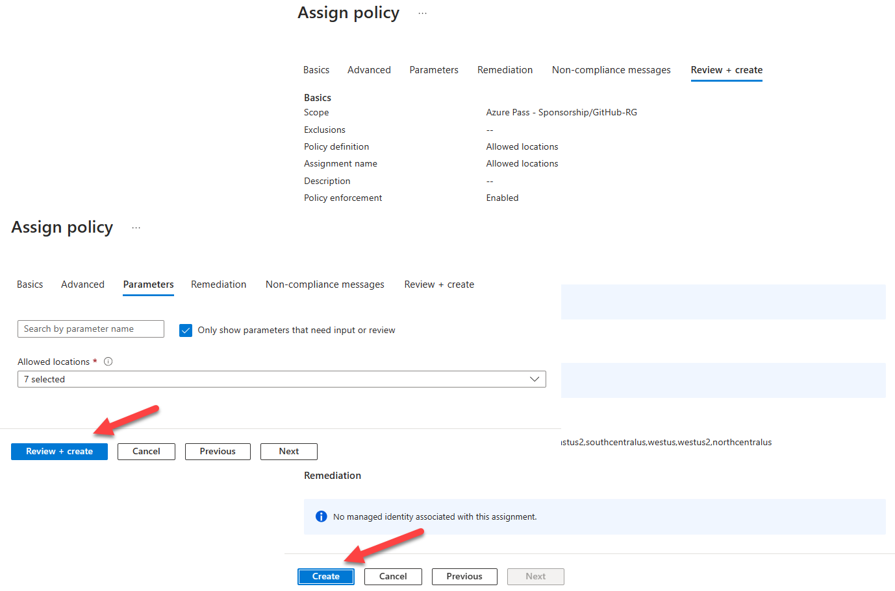

10. The Azure policy assignment will be deployed and enforced on the marketplace resource group.

### Task 2: Test the policy assignment within the marketplace

1. Expand the portal's left navigation by clicking **Show portal menu** then click **+ Create a resource**.

    

2. In the upper-right of the page, next to **Popular Marketplace products**, select **See more in Marketplace**.

    

3. To view only virtual machine offers, click **Product Type** near the top of the page, then select **Virtual Machine**.

    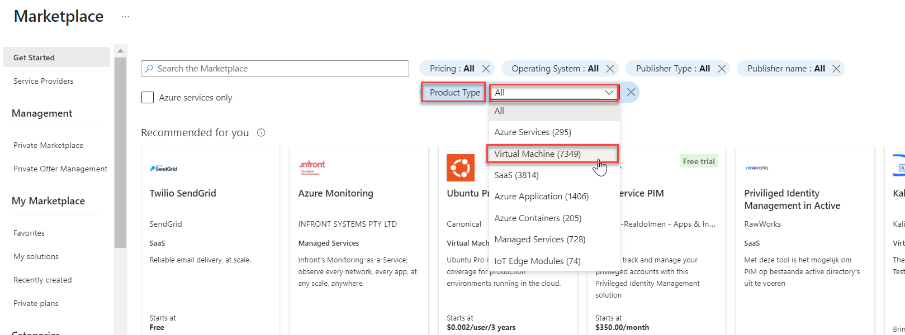

4. You can also filter the results by pricing, operating system, publisher type, and publisher name. You can also select a category on the left of the page to further filter the results.

5. Select the **Windows Server** offer. 

    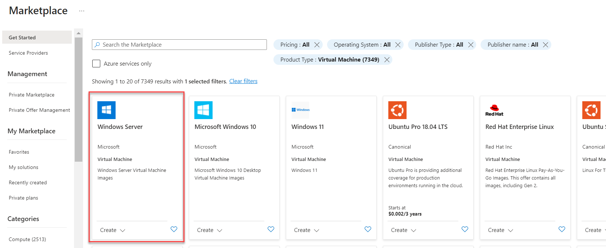

6. Many virtual machine offers have multiple plans, and they can be selected via the **Plan** dropdown. Select **Windows Server 2022 Datacenter** then click **Create**.

    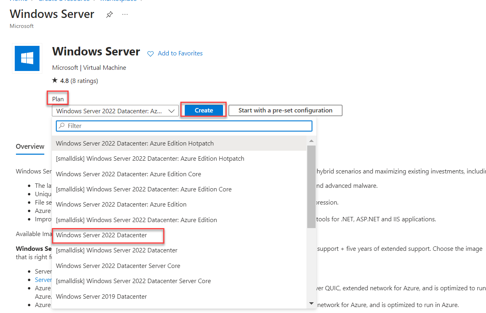

7. Enter the following information then click **Review + create** then **Create**. 

    - Resource group: **LabRG**

    - Virtual machine name: **Enter a unique name**

    - Region: **Canada Central**

    - Username: **demouser**

    - Password/Confirm password: **demo@pass123** 

    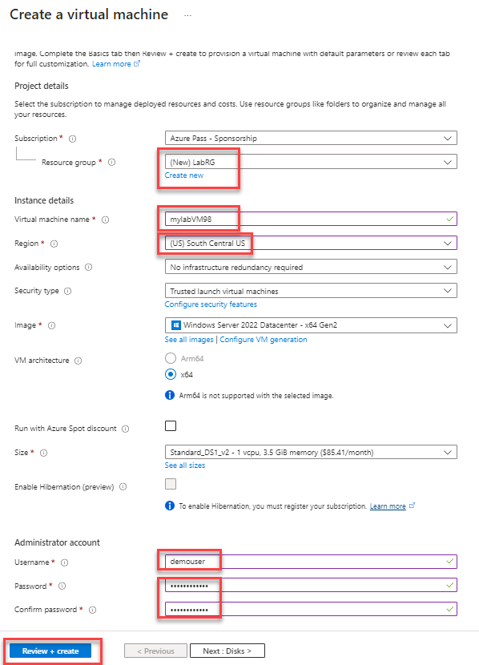

8. Select **Review + create**.

9. You will get a message that the deployment has failed policy.  Review the details to find that the failure was on the location chosen.

10. Return to the **Basics** tab and change the Region to **US East**.  The deployment will succeed.

### Summary

In this exercise, you learned to use Azure Policy to govern resource deployment within Azure. 
